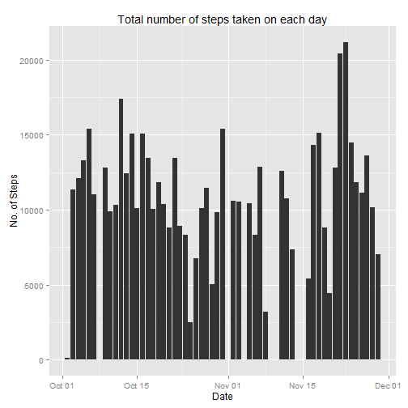
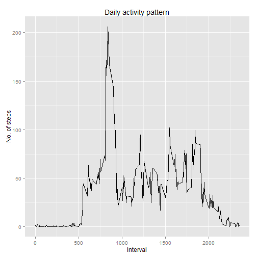
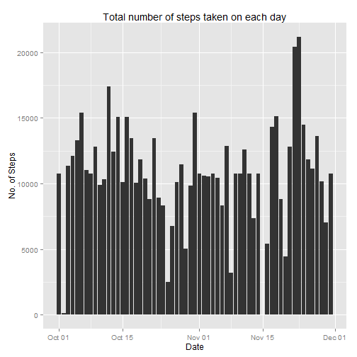
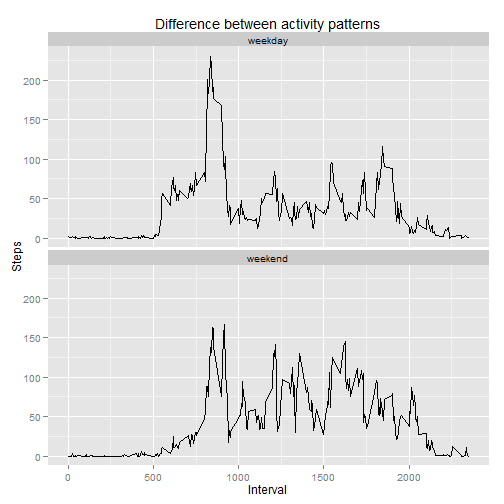

Reproducible Research: Peer Assessment 1
========================================
<br>

### Loading needed packages and setting global options

<br>

### Loading and preprocessing the data
Load data, recode **date** variable, and omit **NA**s. Backup data with **NA**s.

```r
data <- read.csv("./data/activity.csv", header = T, );
dataWithNA <- data;
data <- na.omit(data);
data$date <- as.Date(data$date, format = "%Y-%m-%d");
```
<br>

### What is mean total number of steps taken per day?
Plot histogram, then calculate the mean / median total number of steps taken per day and print out results.

```r
meltDat <- melt(data, id = c("date"), measure.vars = c("steps"));
castDat <- dcast(meltDat, date ~ variable, sum);
qplot(date, steps, data = castDat, geom = "histogram", stat = "identity", xlab = "Date", ylab = "No. of Steps", main = "Total number of steps taken on each day");
```

 

```r
summary(castDat$steps);
```
<br>

### What is the average daily activity pattern?
Use **melt** and **dcast** again to reshape data, then plot using **qplot**. Then print out interval no. with maximum number of steps.

```r
meltDat <- melt(data, id = c("interval"), measure.vars = c("steps"));
castDat <- dcast(meltDat, interval ~ variable, mean);
qplot(interval, steps, data = castDat, geom = "line", xlab = "Interval", ylab = "No. of steps", main = "Daily activity pattern");
```

 

```r
castDat[which.max(castDat$steps),];
```
<br>

### Input missing data
Count **NA** values using **sum** and the backed data set.

```r
sum(is.na(dataWithNA$steps));
```
<br>
Strategy for filling in all of the missing values: look up the **NA**s in the **steps** variable in a copied data set, then use the mean **steps** value of the same interval of **castDat** and copy to **newDat**.

```r
newDat <- dataWithNA;
for(i in 1:dim(newDat)[1]) {
    if(is.na(newDat$steps[i])) {
        newDat$steps[i] = castDat[castDat$interval == newDat$interval[i], "steps"];
    }
}
```
<br>
Plot histogram, as in the first task, to see whether there is a difference or not. Additionally calculate mean / median.

```r
newDat$date <- as.Date(newDat$date, format = "%Y-%m-%d");
meltDat <- melt(newDat, id = c("date"), measure.vars = c("steps"));
castDat <- dcast(meltDat, date ~ variable, sum);
qplot(date, steps, data = castDat, geom = "histogram", stat = "identity", xlab = "Date", ylab = "No. of Steps", main = "Total number of steps taken on each day");
```

 

```r
summary(castDat$steps);
```
### Are there differences in activity patterns between weekdays and weekends?
Firstly, extract the weekdays (in form of a factor) from the **date** variable of **newDat**. This will be helpful later to differentiate between weekdays and weekends. Then use **plyr** package and **mapvalues** to easily rename factors to **weekday** or **weekend**. Finally, append this to the data set.

```r
factor <- as.factor(weekdays(newDat$date));
factor <- mapvalues(factor, from = c("Monday", "Tuesday", "Wednesday", "Thursday", "Friday", "Saturday", "Sunday"), to = c("weekday", "weekday", "weekday", "weekday", "weekday", "weekend", "weekend"));
newDat$day <- factor;
```
<br>
Now proceed as above, thought, this time it is necessary to add **day** also to the **id** argument of **melt** to be able to separate between **weekday** and **weekend**

```r
activityDay <- melt(newDat, id = c("interval", "day"), measure.vars = c("steps"));
activityDay <- dcast(activityDay, interval + day ~ variable, mean);
g <- ggplot(activityDay, aes(x = interval, y = steps)) + geom_line() + facet_wrap( ~ day, ncol = 1) + xlab("Interval") + ylab("Steps") + ggtitle("Difference between activity patterns");
print(g);
```

 
